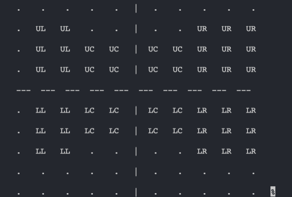
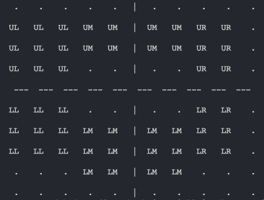

# automated-hvf-grading
humphrey visual field matrix reading, grading and analysis automated via python script for research at Flinders University

### supporting library:
https://github.com/msaifee786/hvf_extraction_script

### Regions 


### Algorithmic Criteria

  category 2) A cluster of at least 3 contiguous points in the same region depressed at P < 5%, with at least one these < 1%

  category 3) A cluster of at least 3 contiguous points in the same region depressed at P < 5% AND (GHT = Outside Normal Limits OR PSD = P < 5%)

### Terminology
    abnormal: there is a defect in eye as given algorithmic criteria is satisfied

    reliable: data is reliable if and only if false pos and fixation loss are both less than 33%

    error: this is a flag to mark that there may be an error present in result due to not being able to extract every feature consequently leading to unreliable dependencies

    progression: a chronological progression of abnormal eye scans

### short hand
  matrix sub-regions: ul, ll, um, uc, lc, lm, ur, lr
  upper left, lower left, upper middle, upper central, lower central, lower middle, upper right, lower right
  final output listed as equivalent medical terms

### location labels
  __left eye__
  "UL": "Superior temporal wedge",
  "LL": "Inferior temporal wedge",
  "UM": "Superior Bjerrum",
  "UC": "Superior paracentral",
  "LC": "Inferior paracentral",
  "LM": "Inferior Bjerrum",
  "UR": "Superior nasal step",
  "LR": "Inferior nasal step",
        
  __right eye__
  "UL": "Superior nasal step",
  "LL": "Inferior nasal step",
  "UM": "Superior Bjerrum",
  "UC": "Superior paracentral",
  "LC": "Inferior paracentral",
  "LM": "Inferior Bjerrum",
  "UR": "Superior temporal wedge",
  "LR": "Inferior temporal wedge",
  
  ### left eye
 
 
 ### right eye
 
      
### To-do
- [x] refactor code using OOP
- [x] refactor into a module
- [x] get driver.py to run
- [x] fix criteria in algorithm (< 5 % not 0.5 %) 
- [x] get extraction to work
- [x] refactor: remove temp_dictionary and use patientData class
- [x] refactor: make dataFrame class and have dataFrame methods -- 

### intial bug fixes based on user requirements
- [x] MD% and PSD% in the criteria for abnormal (criteria 3) [Fix psd < 5%]
- [ ] region defect not detected upon criteria 2 and 3 (see file error2.pdf)
- [ ] location labels mixed up (nasal step labeled as temporal wedge) 
- [ ] extraction failure labels (unable to extract -> more specific label: 'too severe to analyse')
- [ ] VFI extraction (VFI24-2 and VFI are varying formats)
- [x] reliability = FNeg, FPos, FLoss all < 33 %
- [ ] Progression column: comment on what determined whether output if true or false
- [ ] Progression analysis inconsistent (errors sometimes occur)

### GUI / Sonel
- [x] parseDataFrame run data is not defined
- [x] False negatives (list reliability index on GUI)
- [x] highlight/ 'select' a row of the table (ie an individual field) to make it easy to track when scrolling across
- [x] column headings should be locked so when scrolling down the rows these still stay at the top
- [x] implement a more intuitive drop down filter for right and left eye
- [ ] absolutely all user object variables displayed on GUI output

### notes / issues
- [ ] we are extracting only pattern deviation matricies however this package is capable of extracting, processing and analysing other matricies
- [ ] Some PDF are corrupt and will always fail to be processed (tesseract)
- [ ] ght is commonly unable to be extracted, the extraction mechanism/code should be looked into in more detail

### developer notes
to run library environment: 
```
conda create --name automated-hvf-grading
conda activate automated-hvf-grading
conda install pip
conda install -c conda-forge tesseract
pip install hvf-extraction-script
```
### GUI demo

**select python interpreter: automated-hvf-grading**
