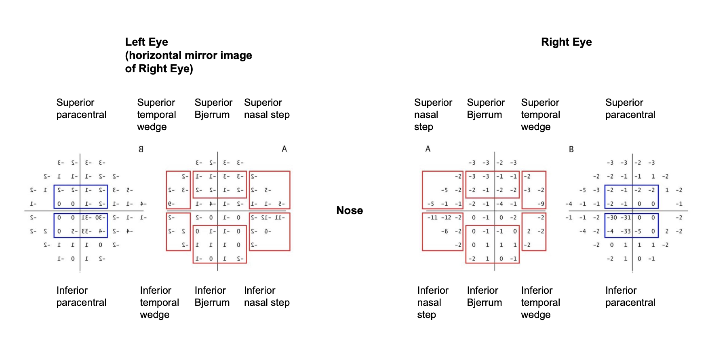

# automated-hvf-grading
humphrey visual field matrix reading, grading and analysis automated via python script

### supporting library:
https://github.com/msaifee786/hvf_extraction_script

### Regions 


### Algorithmic Criteria

  category 2) A cluster of at least 3 contiguous points in the same region depressed at P < 5%, with at least one these < 1%

  category 3) A cluster of at least 3 contiguous points in the same region depressed at P < 5% AND (GHT = Outside Normal Limits OR PSD = P < 5%)

### To-do
- [x] refactor code using OOP
- [x] refactor into a module
- [x] get driver.py to run
- [x] fix criteria in algorithm (< 5 % not 0.5 %) 
- [ ] patient data class with getter and setter methods
- [ ] get extraction to work
- [ ] refactor: remove temp_dictionary and use patientData class
- [ ] refactor: make dataFrame class and have dataFrame methods -- integrate data methods


### intial bug fixes based on user requirements
- [ ] MD% and PSD% in the criteria for abnormal (criteria 3) [Fix psd < 5%]
- [ ] region defect not detected upon criteria 2 and 3 (see file error2.pdf)
- [ ] location labels mixed up (nasal step labeled as temporal wedge) 
- [ ] extraction failure labels (unable to extract -> more specific label: 'too severe to analyse')
- [ ] VFI extraction (VFI24-2 and VFI are varying formats)
- [ ] reliability = FNeg, FPos, FLoss all < 33 %
- [ ] Progression column: comment on what determined whether output if true or false
- [ ] Progression analysis inconsistent (errors sometimes occur)

### GUI / Sonel
- [x] parseDataFrame run data is not defined
- [x] False negatives (list reliability index on GUI)
- [x] highlight/ 'select' a row of the table (ie an individual field) to make it easy to track when scrolling across
- [x] column headings should be locked so when scrolling down the rows these still stay at the top
- [x] implement a more intuitive drop down filter for right and left eye

### notes
- [ ] we are extracting only pattern deviation matricies however this package is capable of extracting, processing and analysing other matricies
- [ ] Some PDF are currupt and will always fail to be processed (tesseract)

### developer notes
```
conda create --name automated-hvf-grading
conda activate automated-hvf-grading
conda install pip
conda install -c conda-forge tesseract
pip install hvf-extraction-script
```

**select python interpreter: automated-hvf-grading**
