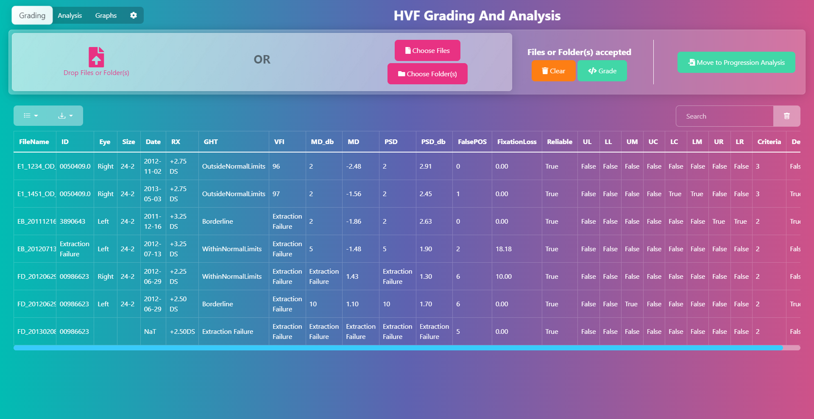

# Automated HVF Grading
Humphrey Visual Field matrix reading, grading and analysis automated via python for research at Flinders University

## Supporting library:
[hvf_extraction_script](
https://github.com/msaifee786/hvf_extraction_script)

## Features
***
- algorithm to automate reading hvf % pattern deviation field scans
- data filtering such as sorting eye by left and right, patient name, chronological order
- automating progression of glaucoma: we can chronologically map past outcomes and apply  progressor criteria (see below) to detect an onset
- parallel processing: runParallel function allows us to run jobs simulatenously on multi-core computer saving time for huge file batches by using full cpu processing capabilities
- your choice of how you use it. Directly through the module, a CLI or via a GUI

## Usage
This library can be used in 3 ways:

**Methods 1 and 2 require the [setup of a conda environment](#developer-setup)**
### 1. Directly through the module
Install the library by running `pip install .` in the root of the repo. Then you can import the library and use it in your code.

### 2. From the CLI
Run `python automated_hvf_grading/cli.py` in the root of the repo.

### 3. Using an easy to use GUI
The Electron based GUI is a wrapper of the CLI. It is bundles with a python environment ~~You can download it from the [releases page]~~ *Coming soon*


## Regions 


## Recent Changes
***
- rewrote entire repository from ground up!
- improved error messages and error checking
- all user bug fixes resolved (7/8 tested)
- more reliable extraction
- more extraction features
- many more features
- improved parallel processing takes full advantage of cpu: program can now process large file batches very quickly on multi-core cpu's


## Algorithmic Criteria
***
  An eye was deemed to have progressed if there was a new cluster of visual field defects that were reproduced in a consecutive field (but not necessarily the same visual field locations). A cluster of visual field defects was defined as 3 contiguous points abnormal in the pattern deviation probability plot at P < 5%, at least one of which is P< 1%. If the GHT was “Outside Normal Limits” or the global PSD was P < 5% on the two consecutive HVFs, then the individual points only needed to be abnormal on the pattern deviation probability plot at P < 5%. 

  In other words:

  category 2) A cluster of at least 3 contiguous points in the same region depressed at P < 5%, with at least one these < 1%

  category 3) A cluster of at least 3 contiguous points in the same region depressed at P < 5% AND (GHT = Outside Normal Limits OR PSD = P < 5%)

## Terminology
    abnormal: there is a defect in eye as given algorithmic criteria is satisfied

    reliable: data is reliable if and only if false pos and fixation loss are both less than 33%

    error: this is a flag to mark that there may be an error present in result due to not being able to extract every feature consequently leading to unreliable dependencies

    confirmation field: "2/3 consecutive chronological defects in the same region" 

    Progrssion in eye was deemed to have progressed if there was a new cluster of visual field defects that were reproduced in a consecutive field (but not necessarily the same visual field locations). A cluster of visual field defects was defined as 3 contiguous points abnormal in the pattern deviation probability plot at P < 5%, at least one of which is P< 1%. If the GHT was “Outside Normal Limits” or the global PSD was P < 5% on the two consecutive HVFs, then the individual points only needed to be abnormal on the pattern deviation probability plot at P < 5%. 

    progressor criteria: any 2 defective scans out of 3 consecutive chronological samples

    Progression column: output is determined as true if the progression criteria listed above is satisfied

    Progression onset: date of the first recorded progression


## Short hand terminology
***
  matrix sub-regions: ul, ll, um, uc, lc, lm, ur, lr
  upper left, lower left, upper middle, upper central, lower central, lower middle, upper right, lower right
  final output listed as equivalent medical terms


## Location labels
  __left eye__
  "UL": "Superior temporal wedge",
  "LL": "Inferior temporal wedge",
  "UM": "Superior Bjerrum",
  "UC": "Superior paracentral",
  "LC": "Inferior paracentral",
  "LM": "Inferior Bjerrum",
  "UR": "Superior nasal step",
  "LR": "Inferior nasal step",
        
  __right eye__
  "UL": "Superior nasal step",
  "LL": "Inferior nasal step",
  "UM": "Superior Bjerrum",
  "UC": "Superior paracentral",
  "LC": "Inferior paracentral",
  "LM": "Inferior Bjerrum",
  "UR": "Superior temporal wedge",
  "LR": "Inferior temporal wedge",
  

  ### left eye
 
 
 ### right eye
 

## To-do
- [x] refactor code using OOP
- [x] refactor into a modules

- [x] get driver.py to run
- [x] fix criteria in algorithm (< 5 % not 0.5 %) 
- [x] get extraction to work
- [x] refactor: remove temp_dictionary and use patientData class
- [x] refactor: make dataFrame class and have dataFrame methods 
- [x] refactor analyseData, build dataFrame into DataFrame class

- [x] create subdf for specific patient
- [x] work on creating sub_dfs for left and right eye
- [x] add medical terms to sub_df title
- [x] sort chronologically just before applying progrssor criteria on subdf for given patient
- [x] fix progression analysis function
- [x] add date of first progression to column
- [x] fix two differnt vfi labels through pattern matching

- [x] processed files changed to file runner
- [x] work on creating a new object for each user object file run as objects previous values get carried across
https://stackoverflow.com/questions/21598872/how-to-create-multiple-class-objects-with-a-loop-in-python
- [x] create driver functions for both concurrent and parallel jobs (8 cores) in driver.py
- [x] parallel environment working
- [x] progression functionality seperated

- [x] filter out N/A on dfs
- [x] add filtering to progressor criteria

- [x] change progressor criteria to take in object
- [x] all functions return progObject
- [x] recheck criteria according to email in processData
- [x] grade trial folder and send results to Nia

## Extensions
- [ ] get working for 32-2 pdfs
- [ ] progressor criteria runs only on scans where reliable = True and error = False, add filtering on dataframe to remove invalid scans

## Intial bug fixes based on user requirements
- [x] MD% and PSD% in the criteria for abnormal (criteria 3) [Fix psd < 5%]
- [x] region defect not detected upon criteria 2 and 3 (see file error2.pdf)
- [x] location labels mixed up (nasal step labeled as temporal wedge) 
- [x] more specific and reliable error messages
- [x] extraction failure labels (unable to extract -> more specific label: 'too severe to analyse')
- [x] VFI extraction (VFI24-2 and VFI are varying formats)
- [x] reliability = FNeg, FPos, FLoss all < 33 %
- [x] Progression column: comment on what determined whether output if true or false
- [x] Progression analysis inconsistent (errors sometimes occur)

- [x] Error: ght unable to be extracted type object 'Hvf_Object' has no attribute 'KEYLABEL_GHT'
- [x] Error: metadata md % not able to be extracted type object 'Hvf_Object' has no attribute 'KEYLABEL_MDP'
- [x] Error: metadata psd % not able to be extracted type object 'Hvf_Object' has no attribute 'KEYLABEL_PSDP'


## GUI / Sonel
- [x] parseDataFrame run data is not defined
- [x] False negatives (list reliability index on GUI)
- [x] highlight/ 'select' a row of the table (ie an individual field) to make it easy to track when scrolling across
- [x] column headings should be locked so when scrolling down the rows these still stay at the top
- [x] implement a more intuitive drop down filter for right and left eye
- [x] absolutely all user object variables displayed on GUI output
- [x] integrate parallel joblib up to 7 jobs for parallel processor for 8 core cpu
- [x] filter by eye left and right integration
- [x] psd % readings extremely inconsistent -- improve readings
- [ ] false_neg_perc sometimes comes out as N/A in extraction on occasions -- needed to determine reliability

## notes / issues
***
__sample field attached to email___
- [ ] the issue with errorSample is that the psd % cannot be properly read or ght.Therefore we cannot determine if criteria 3 is valid so I coded the algorithm to  default to criteria 2

- [ ] progressor criteria not testing on a large sample size -- could still need work

- [ ] __run time__: takes about 36 seconds to completely extract, analyse and asses 20 samples: 1.8 per sample on average (parallel dispatching speeds this up though)

- [x] __mixed up hemifields__
as left and right eyes have differnt hemifields and the extraction is a mixed samples of both left and right eyes then in order to process it we need to divide data frame into left and right eyes seperately before we apply progressor criteria or labelling

To solve this problem, hemifield labels are converted with a map and will not be labelled until data is split into sub-data frames by eye

- [ ] we are extracting only pattern deviation matricies however this package is capable of extracting, processing and analysing other matricies

- [x] Some PDF are corrupt and will always fail to be processed (tesseract)

- [x] ght is commonly unable to be extracted, the extraction mechanism/code should be looked into in more detail


## Developer Setup
***
To create the environment: 
Install either Conda or Miniconda and run the following commands
```bash
conda create --name ENV_NAME regex pillow fuzzywuzzy pandas python-levenshtein numpy joblib IPython pdf2image
conda activate ENV_NAME
conda install -c conda-forge tesserocr poppler
pip install -r requirements.txt
```
To install the modified hvf_extraction_library:
```bash
# navigate to /hvf_extraction_script (modified)
pip install . (OR python setup.py install / develop)
```

Packing env for use in front end:
Using conda-pack
```bash
conda pack -n ENV_NAME -o env.zip
```